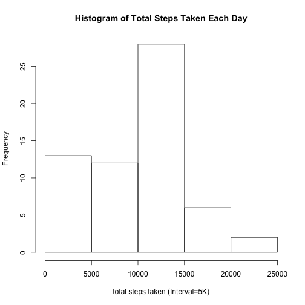
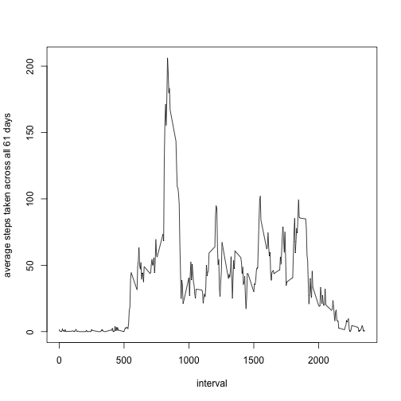
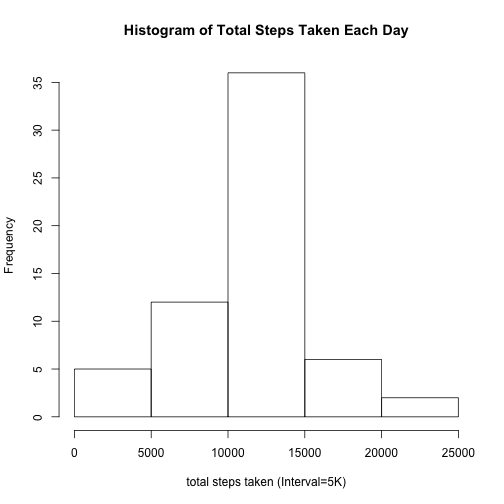
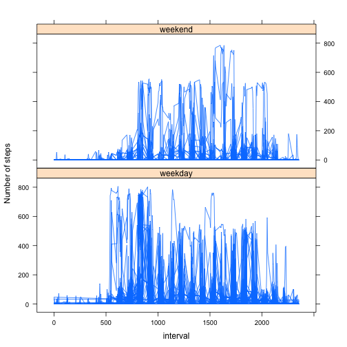

Assignment 1, Reproducible Research
========================================================

# I. Loading and Processing the data


```r
setwd("~/Documents/My Documents/Data Courses/Reproducible Research")
zipUrl<-"https://d396qusza40orc.cloudfront.net/repdata%2Fdata%2Factivity.zip"
download.file(zipUrl, destfile = "tempzip.zip", method = "curl")
unzip("tempzip.zip", files = NULL, list = FALSE, junkpaths = FALSE, exdir = ".", unzip = "internal", setTimes = FALSE)

activity<-read.csv("activity.csv")
```

# II. What is mean total number of steps taken per day?

## 1. Calculate the total number of steps taken per day:

```r
library(base)
library(dplyr)
```

```
## 
## Attaching package: 'dplyr'
## 
## The following objects are masked from 'package:stats':
## 
##     filter, lag
## 
## The following objects are masked from 'package:base':
## 
##     intersect, setdiff, setequal, union
```

```r
library(datasets)
library(lattice)
library(stats)
days<-group_by(activity, date)
sumdays<-summarize(days, steps=sum(steps, na.rm=TRUE))
```
### The total number of steps taken per day is as follows: 

```r
print(as.data.frame(sumdays), row.names=FALSE)
```

```
##        date steps
##  2012-10-01     0
##  2012-10-02   126
##  2012-10-03 11352
##  2012-10-04 12116
##  2012-10-05 13294
##  2012-10-06 15420
##  2012-10-07 11015
##  2012-10-08     0
##  2012-10-09 12811
##  2012-10-10  9900
##  2012-10-11 10304
##  2012-10-12 17382
##  2012-10-13 12426
##  2012-10-14 15098
##  2012-10-15 10139
##  2012-10-16 15084
##  2012-10-17 13452
##  2012-10-18 10056
##  2012-10-19 11829
##  2012-10-20 10395
##  2012-10-21  8821
##  2012-10-22 13460
##  2012-10-23  8918
##  2012-10-24  8355
##  2012-10-25  2492
##  2012-10-26  6778
##  2012-10-27 10119
##  2012-10-28 11458
##  2012-10-29  5018
##  2012-10-30  9819
##  2012-10-31 15414
##  2012-11-01     0
##  2012-11-02 10600
##  2012-11-03 10571
##  2012-11-04     0
##  2012-11-05 10439
##  2012-11-06  8334
##  2012-11-07 12883
##  2012-11-08  3219
##  2012-11-09     0
##  2012-11-10     0
##  2012-11-11 12608
##  2012-11-12 10765
##  2012-11-13  7336
##  2012-11-14     0
##  2012-11-15    41
##  2012-11-16  5441
##  2012-11-17 14339
##  2012-11-18 15110
##  2012-11-19  8841
##  2012-11-20  4472
##  2012-11-21 12787
##  2012-11-22 20427
##  2012-11-23 21194
##  2012-11-24 14478
##  2012-11-25 11834
##  2012-11-26 11162
##  2012-11-27 13646
##  2012-11-28 10183
##  2012-11-29  7047
##  2012-11-30     0
```

## 2. Make a Histogram of the total number of steps taken per day:

```r
hist(sumdays$steps, xlab="total steps taken (Interval=5K)", main = "Histogram of Total Steps Taken Each Day")
```

 

## 3. Calculate and report the mean and median of the total number of steps taken per day

```r
totalstepsday<-sumdays %>% summarize(meansteps=mean(steps, na.rm=TRUE), mediansteps=median(steps, na.rm=TRUE))
mnstps<-totalstepsday$meansteps
mdnstps<-totalstepsday$mediansteps
#this is the mean total number of steps taken per day (values range from 0 to 15K)
```
### The mean of the total number of steps taken per day is 9354.2295082.
### The median of the total number of steps taken per day is 10395.

# III. What is the average daily activity pattern?
## 1. Make a time-series plot (i.e. type = "l") of the 5-minute interval (x-axis) and the average number of steps taken, averaged across all days (y-axis)


```r
meaninterval<-days %>% group_by(interval) %>% summarize(steps=mean(steps, na.rm=TRUE))
with(meaninterval, plot(interval, steps, type = "l", ylab="average steps taken across all 61 days"))
```

 

## 2. Which 5-minute interval, on average across all the days in the dataset, contains the maximum number of steps?

```r
maxsteps<-meaninterval[meaninterval$steps==max(meaninterval$steps), ]$interval
```
### The interval that contains the maximum number of steps is 835

# IV. Inputting missing values

## 1. Calculate and report the total number of missing values in the dataset 

```r
nasteps = sum(is.na(activity$steps)) #total number of rows with NA's
nainterval = sum(is.na(activity$interval)) #confirms no NA values for intervals.
nadate = sum(is.na(activity$date)) #confirms no NA values for dates.
```
### Total number of missing values in the dataset is 2304

## 2. Devise a strategy for filling in all of the missing values in the dataset.
### My strategy is coded below.  

```r
steps2<-ifelse(is.na(activity$steps), meaninterval$steps, activity$steps)
#determine if the value of 'steps' is NA. If so, determine what interval it corresponds to and assign it the value of the total mean steps of that interval (meaninterval$steps). If the value is not NA assign its original value (activity$steps) back to it.
```
## 3. Create a new dataset that is equal to the original dataset but with missing values filled in.
### The code for this step is as follows:

```r
activity2<- activity %>% mutate(steps = steps2)#Create new dataset equivalent to first but with NAs filled in.
```

## 4a. Make a histogram of the total number of steps taken each day:

```r
days2<-group_by(activity2, date)
sumdays2<-summarize(days2, steps=sum(steps, na.rm=TRUE))
hist(sumdays2$steps, xlab="total steps taken (Interval=5K)", main = "Histogram of Total Steps Taken Each Day")
```

 
## 4b. Calculate and report the mean and median total number of steps taken per day.

```r
totalstepsday2<-sumdays2 %>% summarize(meansteps=mean(steps, na.rm=TRUE), mediansteps=median(steps, na.rm=TRUE))
```
### The mean total number of steps taken per day is 1.0766189 &times; 10<sup>4</sup>
### The median total number of steps taken per day is 1.0766189 &times; 10<sup>4</sup>
### These values do differ from the estimates from part I.3.  They are higher.
### The impact of imputing missing values is that it makes the distribution of the data set more "normalized".  This can be seen in both the comparison of the histograms and the comparison of the means and medians.  The histogram of imputed data is more normal (bell-shaped) and the mean and median are very close to being equivalent.

# V. Are there differences in activity patterns between weekdays and weekends?

## 1. Create a new factor variable in the dataset with 2 levels - "weekday" and "weekend" indicating whether a given date is a weekday or weekend day.

```r
day_week<-weekdays(as.POSIXct(days2$date), abbreviate=TRUE) #day_week variable uses "weekdays()" function to determine the actual day (i.e. "Mon", "Tue", "Wed", etc) of days2$date

#daydet assigns the value of either 'weekday' or 'weekend' to a value
daydet<-function(x){
        if(x %in% c("Mon", "Tue", "Wed", "Thu", "Fri")){
                x<-'weekday'
        }
        else{x<-'weekend'}
}
#finaldaydet is a list of character values ('weekday', 'weekend') that is the result of inputting the variable 'day_week' to the function 'daydet' (via sapply)
finaldaydet<-as.character(sapply(day_week, daydet))

days2 <-cbind(days2, finaldaydet) #days2 is a dataframe now containing where each value of each variable falls, whether on a weekday or weekend.
days3<-group_by(days2, finaldaydet)#days3 now groups the dataframe by value of 'finaldaydet'
```

## 2. Make a panel plot containing a time series plot (i.e. type = 'l') of the 5-min interval (x-axis) and the average number of steps taken, averaged across all weekday days or weekend days (y-axis).

```r
c<-xyplot(steps~interval|finaldaydet, data = days3, ylab="Number of steps", type="l", layout=c(1, 2))
print(c)
```

 
